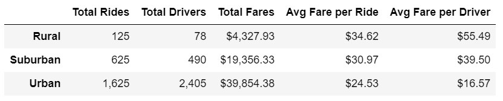
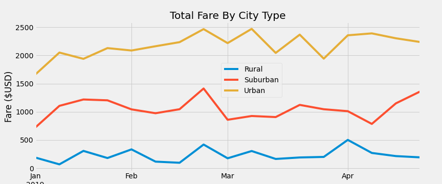

# PyBer Analysis

## Purpose

The purpose of this project was to analyze raw data from the PyBer ride-sharing app to highlight any differences between urban, suburban, and rural usage and make recommendataions to the PyBer Management Team.

## Results

After merging ride data with city data we had a comprehensive data set on which to perform our analysis. We grouped the data by city type to count the total number of rides and calculate the sum of the fares, the average fare, and the average fare per driver for each city type. The results are in the DataFrame below:  

We then created a line plot showing the total fares each week for each city type over the course of several months. In order to generate the chart, we had to manipulate the data, grouping the ride data by city type and date, pivoting the table so that the date was the index, and resampling the dates to group them into weeks. 

## Summary

Based on the results, we can make several recommendations to the PyBer management team:

1. While it makes more sense that there are more PyBer riders and drivers in urban areas simply because of population density, it would be financially beneficial to try to increase suburban and rural usage where rides are generally longer and thus more profitable.
2. PyBer's next marketing campaign should be targeted at suburban and rural users, possibly offering promo codes/discounts to attact new users who - once they see how easy and convenient PyBer's ride-share service is - will become regular users.  
3. PyBer can also try to lure some drivers to suburban and rural areas by showing them the disparity in average fare per driver; this would decrease the wait time for riders, a factor that is often a deterrent in more remote areas.
